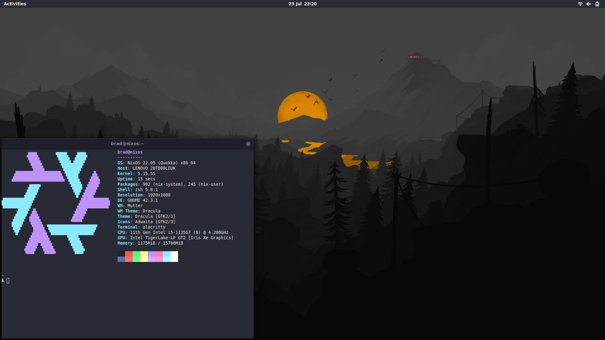

# Bradley's NixOS Configuration

I recently moved from Arch to NixOS, after trying to find a way to incorporate
easily declare a configuration for my laptop. If all goes well, the end result
should look like the above.

## How to use

- Clone this repository: `git clone git@github.com:bradb423/nixos-hosts.git && cd nixos-hosts`
- Run the script: `./link.sh`
- Then use the command `sudo nixos-rebuild switch` to take in the changes
