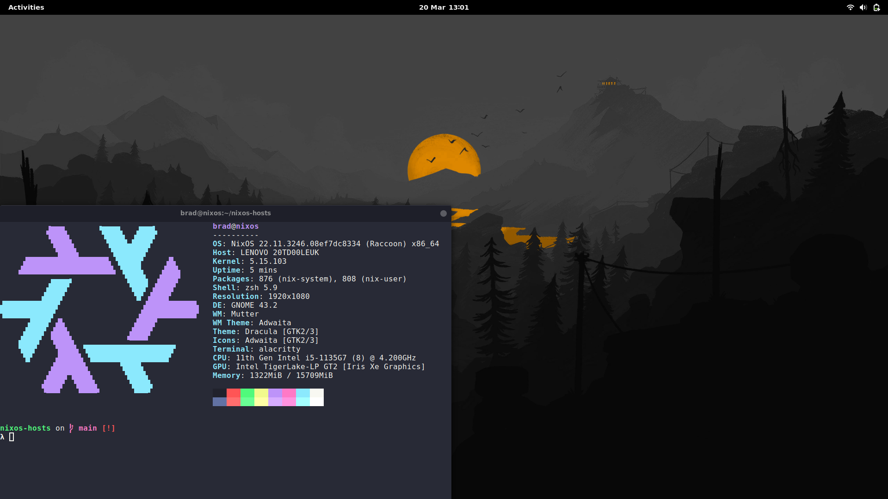

# Bradley's NixOS Configuration



My NixOS setup, with all of my dotfiles and user packages. If the installation
goes right, the end result should look like the above.

## How to use

- Clone this repository:
  `git clone https://github.com/bradb423/nixos-hosts.git && cd nixos-hosts`
- Make sure you enter the right disk and bootloader information in
  `system-config/core/bootloader.nix` and `hardware-configuration.nix`.
- Run the script: `./link.sh`
- Then use the command `sudo nixos-rebuild --flake .#nixos switch` to take in
  the changes

## Templates

The directories `flake-templates/` and `shell-templates/` contain skeletons for
Nix flakes and shells that I use within projects. Feel free to use them.

## Using the list ordering utility

I like to keep my lists ordered alphabetically, and so there is a small program
`list-orderer` which will take a list within a config file, and order it.

Usage:

- You can install cargo using the shell template `nix-shell shell-templates/rust.nix`
- `cd list-orderer`

```console
The list ordering utility provides the ability to aplhabetically order items in
lists. This is useful for ordering the lists of packages in this repository,
such as in `user-config/personal-packages.nix`


Usage: list-orderer <FILENAME> <START_LINE> <END_LINE>

Arguments:
  <FILENAME>    The name of the file to look into
  <START_LINE>  The starting line to start ordering from
  <END_LINE>    The ending line to stop ordering at

Options:
  -h, --help     Print help
  -V, --version  Print version
```

## dconf_dump.sh

GNOME's settings are not in the form of a configuration file, and are instead
more akin to a registry (similar to Windows). To ensure that the settings that
I like are consistent between devices, I use the program `dconf2nix` which
reads the settings from dconf and places them into a Nix file which later
becomes part of my overall NixOS configuration.

The script at `scripts/dconf_dump.sh` pulls the `dconf` settings, then pipes the
result into `dconf2nix` and redirects the output into the configuration file
`user-config/display/dconf.nix`
